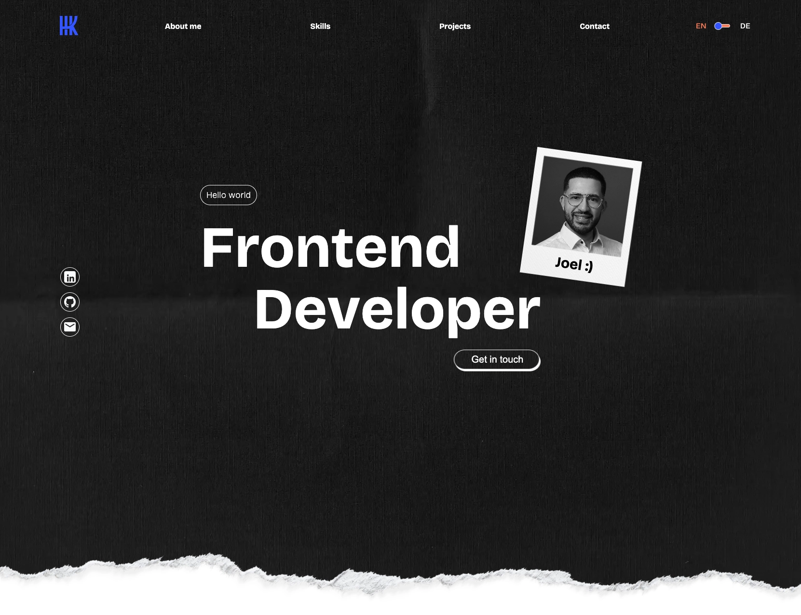

# Joel Baig - Frontend Developer

🚀 Open to Junior Frontend Developer opportunities

Welcome to my portfolio project. This website showcases my skills, projects and experience as a frontend developer. The application was built with Angular, TypeScript and SCSS and focuses on clean design, responsive layouts and modern web development practices.

## 🌐 Live Demo

Visit the live version here:

https://joelbaig.com

---

## 📸 Preview

---

## ✨ Features

- Responsive design for desktop, tablet and mobile devices
- Multi-language support (English / German)
- Interactive animations and hover effects
- Contact form with email functionality
- Modern and clean user interface
- Smooth scrolling navigation
- Optimized user experience across different screen sizes

---

## 🛠️ Tech Stack

### Frontend

- Angular
- TypeScript
- HTML5
- SCSS

### Development Tools

- Git
- GitHub
- Visual Studio Code
- npm

### Additional Concepts

- Responsive Web Design
- Component-Based Architecture
- REST API Integration
- Internationalization (i18n)
- Performance Optimization

---

## 📂 Project Structure

text src/ ├── app/ │   ├── components/ │   ├── shared/ │   ├── services/ │   └── pages/ ├── assets/ ├── environments/ ├── styles/ └── index.html 

---

## 🚀 Installation

Clone the repository:

bash git clone https://github.com/JoelBaig/portfolio.git 

Navigate into the project folder:

bash cd portfolio 

Install dependencies:

bash npm install 

Start the development server:

bash ng serve 

Open your browser:

text http://localhost:4200 

---

## 🎯 Goals of This Project

The purpose of this portfolio is to:

- Showcase my frontend development skills
- Present selected projects and achievements
- Demonstrate responsive design principles
- Practice modern Angular development
- Provide recruiters and companies with an overview of my work

---

## 👨‍💻 About Me

I am a frontend developer from Germany with a strong interest in creating modern, responsive and user-friendly web applications.

My main focus is Angular development, TypeScript and clean UI implementation. I enjoy learning new technologies and continuously improving my development skills through practical projects.

---

## 📬 Contact

### LinkedIn

https://www.linkedin.com/in/joel-baig-51ab56305

### GitHub

https://github.com/JoelBaig

### Portfolio Website

https://joelbaig.com

---

## 📄 License

This project is intended for portfolio and demonstration purposes only.

© Joel Baig